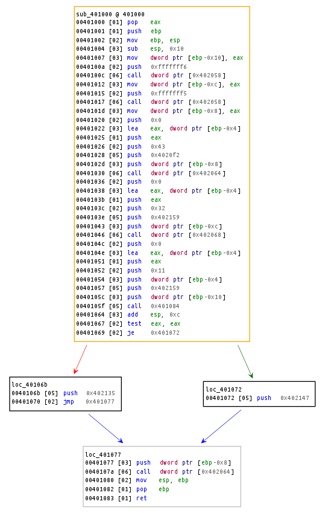
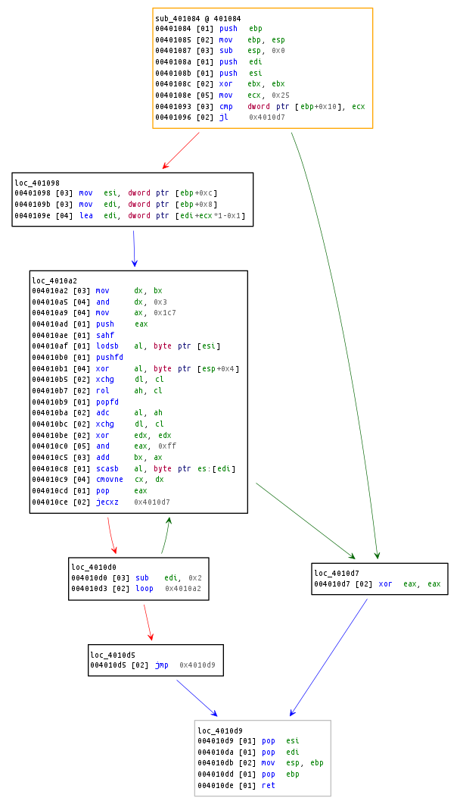

# README

We'll show you how to solve **challenge #2** from [Flare-On Challenges 2015](http://flare-on.com/files/2015_FLAREOn_Challenges.zip).

Challenge #2 is a windows binary that asks for a password. When the correct password is provided it prints **You're success**, otherwise it prints **You're failure**.

Instead of manually reversing the binary to find the correct password, we'll solve it automatically using the **concolic execution** feature provided by **BARF**.

## Quick analysis

The main function is located at address ``0x401000`` (graph below) and is responsible for checking the password and printing the messages. If you enter the correct password, the branch at address ``0x40106b`` is taken and the successful message is printed. The branch is taken based on the result of the function ``0x401084``, which has to be ``non-zero``.



Now, let's take a look at function ``sub_401084``. The first thing to note is that it takes three parameters. The second, that there's a loop at address ``0x4010a2`` that processes bytes from one address and compares them to the bytes of the other address, one at a time. Soon we realize, these addresses correspond to the input buffer and a hardcoded string that we'll call the reference key. The missing parameter is the length of the input data.



## Finding the correct password

So, if we want the program to print **You're success** we'll have to reverse the latter function so we can understand how to build a string that after being processed matches the reference key. However, there is a much easier way to achieve the same goal, automatically, using **concolic execution**. That is, we'll execute the function and set the input buffer as symbolic. Also, we'll mark address ``0x004010d5`` as our target address. If you take a loop at the CFG you'll see that execution goes through this path if and only if the password is correct. In short, we'll do the following:

1. **Load** the binary;
2. **Create** a initial and a final state, setting the conditions on which the function should start and end;
4. **Execute** the function concolically and set address ``0x004010d5`` as our target and, finally,
5. **Retrieve** the content of the input buffer from memory.

### Loading the binary

To load the binary, we create a instance of a ``BinaryFile``. Then, we create a ``ReilContainer`` for the function of interest, in this case, function ``sub_401084``.

```python
# Load the binary
binary = BinaryFile("bin/very_success")

arch_info = X86ArchitectureInformation(binary.architecture_mode)

# Create a REIL container for the function of interest
functions = [
    # name       | start     | end
    ("sub_401084", 0x00401084, 0x004010de)
]

reil_container = ReilContainerBuilder(binary).build(functions)
```

### Create an initial and a final State

We create an **initial state** so we can specify the value of registers and memory once the concolic execution starts. In this case, we set the value of the stack pointer (``esp``) and the parameters aforementioned. We also extract the hardcoded reference key from the binary and write it to memory.

We do the same for the **final state**, however, there's nothing we would like to set or assert once the execution finishes.

```python
# Set up initial state
initial_state = State(arch_info, mode="initial")

# Set up stack pointer
esp = 0xffffceec

initial_state.write_register(esp, 0xffffceec)

# Set up parameters
initial_state.write_memory(esp + 0xc, 4, 0x25)       # password length
initial_state.write_memory(esp + 0x8, 4, 0x00402159) # password address
initial_state.write_memory(esp + 0x4, 4, 0x004010e4) # reference key address

# Set memory content
for i in xrange(user_password_len):
    initial_state.write_memory(ref_key_addr + i, 1,
                               ord(binary.text_section[ref_key_addr + i]))

# Set up final state
final_state = State(arch_info, mode="final")
```

### Execute the Function Concolically

Now, it is all set to **concolically execute** the function.

```python
sym_exec = ReilSymbolicExecutor(binary.architecture_mode)

paths = sym_exec.find_address(
    reil_container, start=0x00401084, end=0x004010de,
    find=0x004010d5, avoid=[0x004010d7], initial_state=initial_state)
```

As you can see, what we are trying to do here is to find a path that connects the initial state at address ``0x00401084`` to a final state at address ``0x004010de``. Once found, we can query the memory for the input buffer.

### Retrieve the Content of the Input Buffer from Memory

```python
# Query the memory for input buffer content
se_res = SymExecResult(arch_info, initial_state, paths[0], final_state,
    binary.architecture_mode)

user_password = bytearray()

for i in xrange(user_password_len):
    user_password.append(se_res.query_memory(user_password_addr + i, 1))
```

## Conclusion

You can see the full script [here](solve.py).
